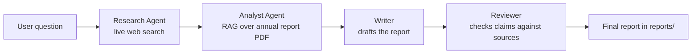

# Agentic AI Business Analyst (LangChain + RAG)

A team of AI agents that answers a business question by combining **live web data** with a **private company document**. Built with Python and LangChain as part of an Agentic AI course project.

Example question: *"How is Tata Motors Passenger Vehicles positioned in India's EV market?"*

## How it works



| Stage | What it does |
|---|---|
| Research Agent | ReAct agent using a Serper (Google) web search tool |
| Analyst Agent | ReAct agent that searches the PDF with a RAG tool (PyPDF, text splitting, BM25 retrieval) |
| Writer | LCEL chain that combines both sources into a structured report with `[Web]` / `[Report p.N]` labels |
| Reviewer | LCEL chain that checks the draft against the sources and flags period/definition mismatches |
| Memory | Follow-up questions are rewritten as standalone questions using recent conversation history |

## Concepts demonstrated
System prompts and backstories, LCEL chains, sequential and parallel chains, `RunnableLambda` data cleaning, ReAct agents, custom `@tool` functions, conversational memory, Retrieval-Augmented Generation, and multi-agent collaboration.

## Setup

```bash
python -m venv venv
venv\Scripts\activate          # Windows (use source venv/bin/activate on Mac/Linux)
pip install -r requirements.txt
copy .env.example .env         # then add your own API keys
```

Put your PDF in `data/` and set `PDF_FILENAME` in `tools/pdf_rag.py`. This project used the Tata Motors Passenger Vehicles 81st Integrated Annual Report FY2025-26, downloaded from the company's investor page (not included in this repo). `trim_pdf.py` shows how it was cut down to the relevant sections.

## Run

```bash
python main.py
```

Ask a question, then ask follow-ups such as *"What about its charging network?"*. Reports are saved to `reports/`.

## Notes and limitations
- Free API tiers have strict rate limits, so the pipeline pauses between stages (about 4 to 6 minutes per question).
- Retrieval uses keyword matching (BM25). Embeddings and a vector store would match by meaning and are a natural next step.
- Models differ in how reliably they call tools. The tool names and prompts were adjusted after testing.
- AI-generated figures should be checked against the cited source pages before use. Page numbers refer to PDF page positions in the original report.

## Tech stack
Python, LangChain, LangGraph, Groq (`openai/gpt-oss-120b`), Serper API, PyPDF, rank_bm25